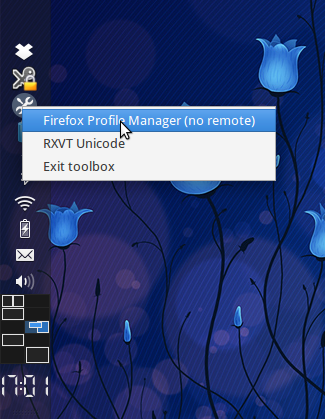

Toolbox
=======

[][Haskell.org]
[][tl;dr Legal: BSD3]

[](https://travis-ci.org/trskop/toolbox-tray-icon)


Description
-----------

Tray icon with configurable popup menu.


Screenshots
-----------





Configuration
-------------

Configuration file is a simple [JSON][json.org] file.

Basic configuration file resides in installation data directory, please see
[Cabal User Guide: Installation paths][] for details about what it means. Its
content is empty JSON array, i.e. `[]`.

User configuration file is located in:

    $HOME/.config/toolbox/toolbox-menu.json

Example configuration file:

````json
[ { "id": "firefox-profile-manager-no-remote"
  , "name": "Firefox Profile Manager (no remote)"
  , "description": "firefox -ProfileManager -no-remote"
  , "command": "firefox -ProfileManager -no-remote &"
  }
, { "id": "rxvt"
  , "name": "RXVT Unicode"
  , "description": "RXVT Unicode"
  , "command": "rxvt &"
  }
]
````

Most of it is self-explanatory, but few things should be pointed out.

* Property `id` is currently used only by GTK backend and it is used to
  identify specific menu item. For this reason it has to be unique.
* Notice that all commands have `&` at the end. This is due to the fact that we
  use `system` to execute commands and leaving it in a foreground would block
  GUI.


Building
--------

### System dependencies

* [GTK 2.*][GTK Homepage]
* [wxWidgets 2.9 or 3.0][wxWidgets Homepage]

On Ubuntu 14.04 above dependencies can be installed using:

````bash
apt-get install libgtk2.0-dev libwxgtk3.0-dev libwxgtk-media3.0-dev
````

### Bilding Using Stack

```
cd toolbox-tray-icon
stack --stack-yaml=stack-lts-5.yaml install
```

### Bilding Using Cabal

GTK backend uses Haskell [gtk][Hackage: gtk] (tested only with version
0.13.0.3) library and that requires
[gtk2hs-buildtools][Hackage: gtk2hs-buildtools] (version of gtk and
gtk2hs-buildtools should match) to be installed before installing it. Package
[gtk2hs-buildtools][Hackage: gtk2hs-buildtools] requires
[alex >= 3.0.1][Hackage: alex] and [happy >= 1.18.9][Hackage: happy], so make
sure you have them on your system or install them.

Ubuntu 14.0.4 has sufficiently new versions of [happy][Hackage: happy] and
[alex][Hackage: alex] so they can be installed using system package manager:

````bash
apt-get install alex happy
````

To build this package, with above dependencies met, just download sources
either using Git or by downloading an archive and then use cabal to install it.
With sandboxing it would look as follows:

````bash
mkdir -p toolbox-tray-icon/bin; cd toolbox-tray-icon
wget https://github.com/trskop/toolbox-tray-icon/archive/master.tar.gz -O toolbox-tray-icon-master.tar.gz
cabal sandbox init
cabal install gtk2hs-buildtools
cabal install --only-dependencies toolbox-tray-icon-master.tar.gz
cabal install --symlink-bindir=bin toolbox-tray-icon-master.tar.gz
````

Now you should be able to find two executables in `toolbox-tray-icon/bin`
directory:

* `toolbox-gtk` -- Uses Haskell GTK library as a backend.
* `toolbox-wx` -- Uses wxHaskell as a backend.


[Cabal User Guide: Installation paths]:
  https://www.haskell.org/cabal/users-guide/installing-packages.html#installation-paths
  "Cabal User Guide: Installation paths"
[GTK Homepage]:
  http://www.gtk.org/
  "GTK Homepage"
[Hackage: alex]:
  http://hackage.haskell.org/package/alex
  "alex Package on Hackage"
[Hackage: gtk]:
  http://hackage.haskell.org/package/gtk
  "gtk Package on Hackage"
[Hackage: gtk2hs-buildtools]:
  http://hackage.haskell.org/package/gtk2hs-buildtools
  "gtk2hs-buildtools Package on Hackage"
[Hackage: happy]:
  http://hackage.haskell.org/package/happy
  "happy Package on Hackage"
[Haskell.org]:
  http://www.haskell.org
  "The Haskell Programming Language"
[json.org]:
  http://json.org/
  "JSON definition and homepage"
[tl;dr Legal: BSD3]:
  https://tldrlegal.com/license/bsd-3-clause-license-%28revised%29
  "BSD 3-Clause License (Revised)"
[wxWidgets Homepage]:
  http://wxwidgets.org/
  "wxWidgets Homepage"
